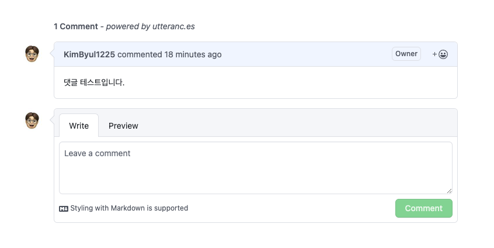

# Blog Comments
 

 
  

## Detail 💻
### 1.Gatsby Blog Comments 관리.
- 해당 repository는 Gatsby Blog의 댓글 기능을 위한 repository 입니다.

 

### 2. utterances 사용.
- 댓글 기능을 위해 <a display="block" href="https://github.com/apps/utterances">utterances</a> 사용.
 

